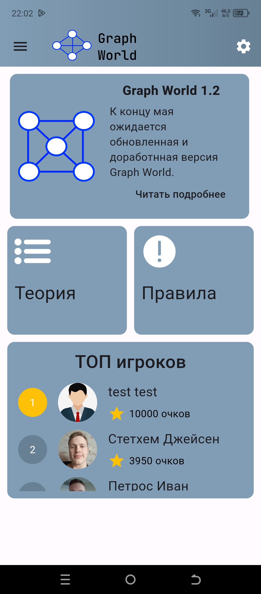
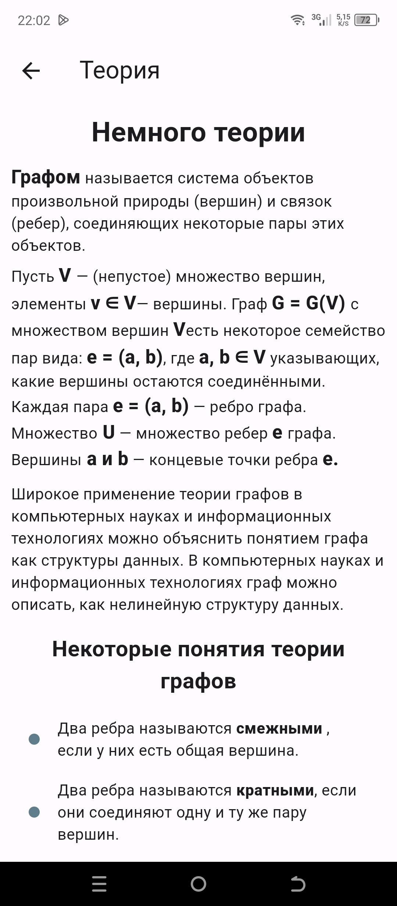
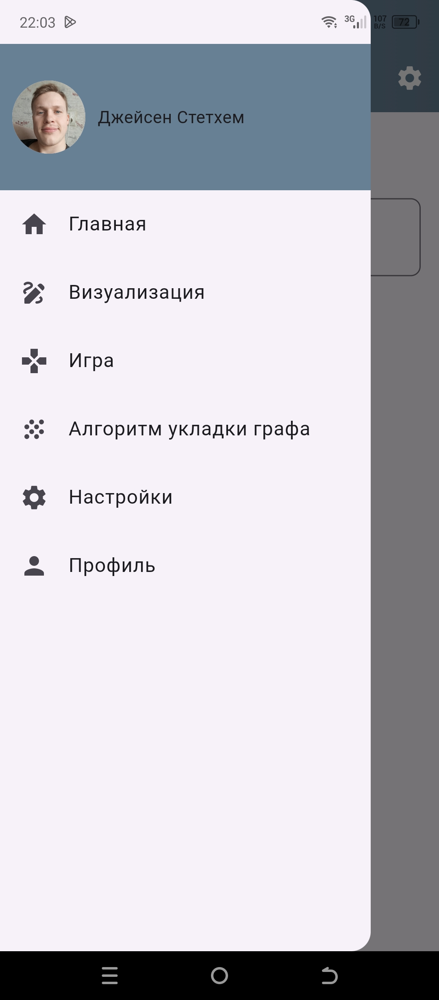
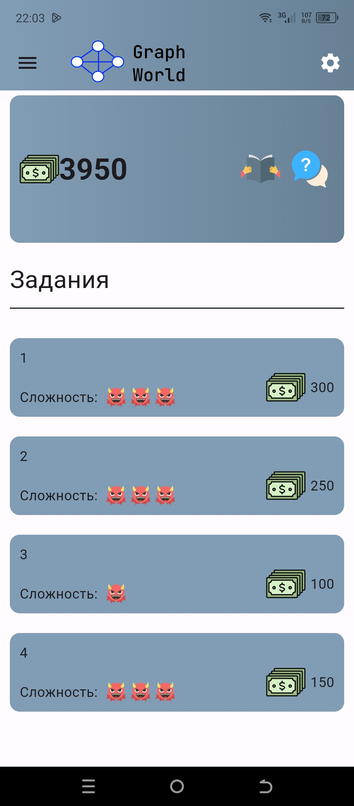
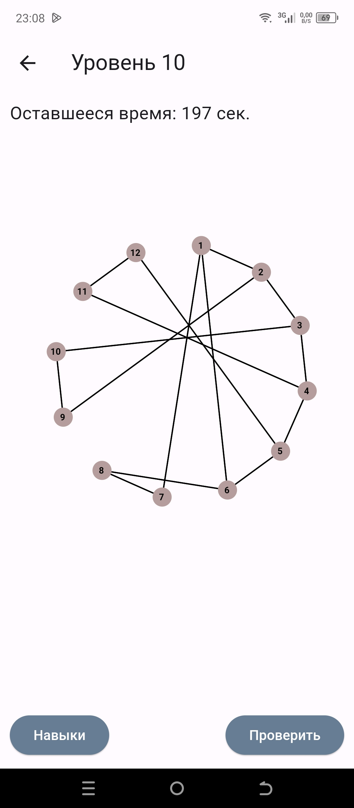
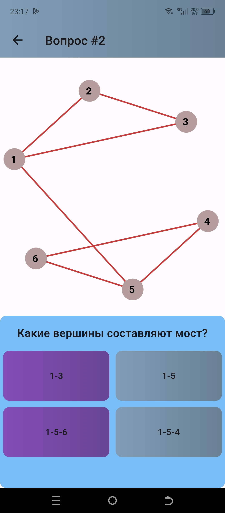
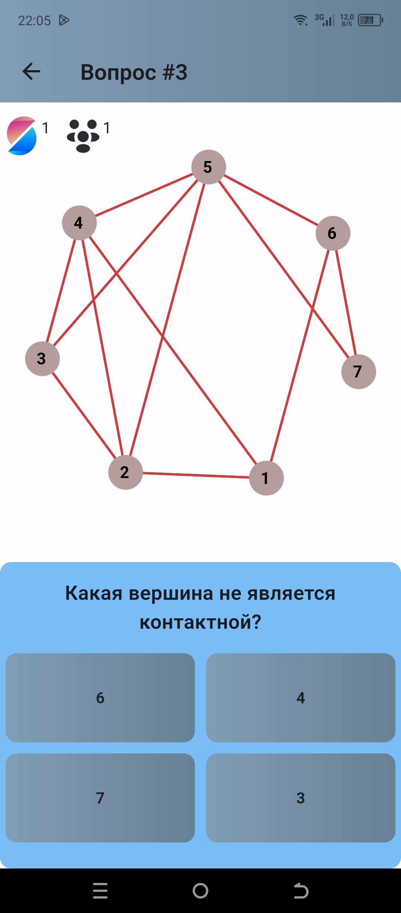

# Graph App

Graph App — это приложение, разработанное на Flutter, которое позволяет работать с графами, исследовать их свойства и применять различные алгоритмы. Приложение отлично подойдет для студентов, разработчиков и всех, кто интересуется теорией графов.

## 📌 Возможности

### 🎨 Интуитивно понятный интерфейс для работы с графами
- Ввод матриц смежности для определения графов.
- Визуализация графов с четкими и интерактивными схемами.

### ⚙️ Алгоритмы для работы с графами
- Реализованы популярные алгоритмы:
  - Поиск в ширину (BFS) и поиск в глубину (DFS).
  - Алгоритмы поиска кратчайшего пути (Дейкстра).
  - Алгоритмы минимального остовного дерева (Прима, Краскала)
  - Проверка связности и поиск сильно связных компонент.
  - Обнаружение циклов и многое другое!

### 📊 Анализ свойств графов
- Определение характеристик графов:
  - Степень вершин.
  - Связность.
  - Нахождение Эйлеровых и Гамильтоновых путей.
  - Проверка планарности графа.

### 🏆 Задачи на графы
- Выполнение заданий по теории графов с проверкой правильности решений.
- Практика в решении задач и изучении алгоритмов.

### 🔐 Авторизация пользователей
- Безопасная авторизация для персонализации работы.
- Сохранение графов и настроек в профиле пользователя.

## 💻 Технологический стек

- **Фреймворк:** Flutter (кроссплатформенность: Android, iOS, Web).
- **Бэкенд:** Firebase.
- **Хранилище данных:** Локальное хранилище.

## 📷 Скриншоты

<div style="display: flex; flex-wrap: wrap; justify-content: space-beetwen gap: 20px;">
    
    
    
    
    
    
    
    
</div>


## 🚀 Установка

1. Клонируйте репозиторий:
   ```bash
   git clone https://github.com/yourusername/graph-app.git
2. Перейдите в директорию проекта:
   ```bash
   cd graph-app
3. Установите зависимости
   ```bash
   flutter pub get
4. Запустите приложение
   ```bash
   flutter run
